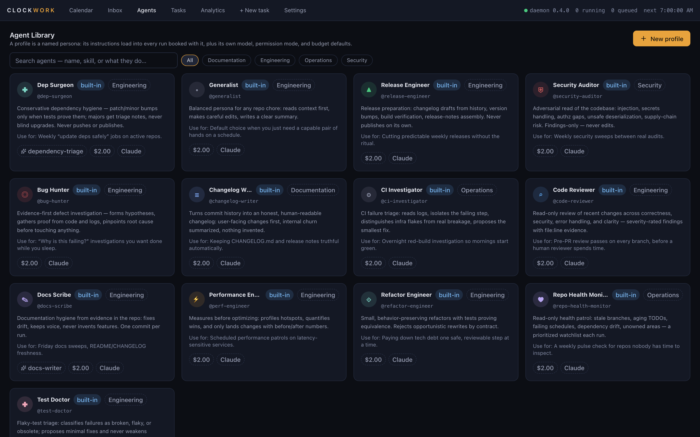

<div align="center">

# ⏰ CLOCKWORK

### The calendar where your AI agents show up for work.

**Book → Run → Review → Repeat**

Schedule recurring AI agent jobs on a real calendar. Clockwork executes them
unattended in isolated, sandboxed worktrees — and files a report you can
actually read.

[Website](https://vimoxshah.github.io/clockwork/) · [Download](#-installation) · [Contact](mailto:vmoksh.shah179@gmail.com) · [Agent Library](#-agent-profile-library) · [Providers](#-providers) · [Security](#%EF%B8%8F-security-model)

   [](https://vimoxshah.github.io/clockwork/)

</div>

---

## Why

You already pay for a coding agent. It idles 18+ hours a day.

Recurring agent work today lives in crontabs, shell scripts, CI pipelines, and
sticky notes. Clockwork gives that work a home on a **real calendar**:

| Without Clockwork | With Clockwork |
|---|---|
| Cron + terminal tabs | Month calendar with every job visible |
| Hope the script worked | Report with branch, diffstat, cost, transcript |
| Unbounded token spend | Hard USD / turn / wall-clock caps |
| Agent has your whole disk | Per-run OS-sandboxed git worktree |
| Find last Tuesday's run: scrollback | Full-text search across retained history |

## Screenshots

| Month calendar — the default view | Task composer |
|---|---|
|  |  |

| Agent library | Command palette (⌘K) |
|---|---|
|  |  |

## The Loop

```
BOOK    Pick an agent profile, repo, budget, and time. One-off or recurring.
  ↓
RUN     Your own CLI engine executes unattended inside an OS-sandboxed
        git worktree. Never touches main. SSH keys unreadable.
  ↓
REVIEW  A human-readable report lands in your inbox — what it did,
        what it skipped and why, what it cost.
  ↓
REPEAT  Make it weekly. Search your retained run history.
```

## ✨ Highlights

- 🗓 **A real calendar** — month/week views, recurrence (RRULE + cron),
  missed-run policies, per-repo mutex, queue with reasons
- 👤 **Human + agent time** — subscribe your personal calendar via read-only
  ICS; see meetings next to scheduled agent work
- 🔀 **Provider freedom** — Claude Code, Codex CLI, OpenCode, and Hermes Agent;
  switch per task without rebuilding anything
- 🤖 **13 production-grade agent profiles** — Dependency Surgeon, Test Doctor,
  Security Auditor, Code Reviewer and more, each with mission, constraints,
  safety rails, and an output contract
- 🛡 **Human-in-the-loop approvals** — risky actions pause the run and ask you;
  unanswered asks fail safe (never silently approved)
- 🔎 **Searchable execution history** — FTS across every report and transcript;
  ⌘K command palette everywhere
- 💰 **Budget enforcement by the supervisor** — USD soft cap, turn limits,
  wall-clock timeouts enforced outside the model
- 🔗 **Agent chains** — sequence agents (scan → fix → test → PR); each stage
  waits for its upstream and receives its report via `{{previous.report}}`
- 🔑 **Bring your own key** — OpenAI-compatible API providers (Anthropic,
  OpenAI, Google, OpenRouter, xAI, Mistral, DeepSeek, Ollama, custom gateways)
  with keys sealed in the macOS Keychain, connection validation, and clear
  separation from CLI-subscription billing
- 🐳 **Remote execution target** — run agents in ephemeral Docker containers
  with filesystem isolation, no-network-by-default, CPU/memory/pids caps, and
  runtime-only credential injection
- 🏛 **Governance built-in** — policy engine (engine allow-lists, per-run cost
  ceilings, approval thresholds), append-only audit log, retention sweeps
- 📊 **Cost & reliability analytics** — spend by task/provider/day with
  optimization suggestions that surface money-burning failures
- 🏠 **Local-first** — SQLite in `~/.clockwork`, loopback-only API, no account,
  no cloud, no telemetry

## Providers

Clockwork drives the CLIs you already have — **no API keys required**.

| Provider | Auth | Status |
|---|---|---|
| **Claude Code** (default) | Your Claude subscription login | ✅ |
| **Codex CLI** | Your ChatGPT/Codex login | ✅ |
| **OpenCode** | Its own configured model | ✅ |
| **Hermes Agent** (Nous Research) | Your Hermes-configured provider/model | ✅ |

Detection is automatic (`Settings → Providers`): if the CLI is installed and
logged in, it appears with its version and a health check. Select the engine
per task in the composer — same task schema regardless of provider.

<details>
<summary><b>How provider execution works</b></summary>

Every provider implements the same `AgentRunner` contract (`packages/shared/src/runner.ts`):
spawn in the run's worktree, stream progress logs over SSE to the UI, enforce
budget bounds at supervisor level, map exits to failure classes
(auth / capacity / timeout / budget), and return a structured outcome that
becomes the report. Hermes runs via `hermes -z` one-shot mode with
`--usage-file` cost telemetry; Claude Code via `claude -p --output-format
stream-json`; Codex and OpenCode via their native headless modes.

</details>

## 🤖 Agent Profile Library

Profiles are production-grade operating contracts, not name stickers. Each one
defines mission, constraints, hard safety rules, and an output contract.

| Engineering | Operations & Docs |
|---|---|
| **Dep Surgeon** — patch/minor bumps proven by tests; majors get triage notes, never blind upgrades | **CI Investigator** — infra-flake vs regression triage from real logs |
| **Test Doctor** — flaky vs broken classification, minimal fixes, never weakens assertions | **Repo Health Monitor** — morning digest: stale branches, drift, advisories |
| **Bug Hunter** — evidence-first root cause before any fix | **Docs Scribe** — fix documentation drift from code evidence |
| **Code Reviewer** — read-only, severity-rated findings with file:line evidence | **Changelog Writer** — entries derived from actual diffs, never invented |
| **Refactoring Engineer** — behavior-preserving, tests green at every step | |
| **Performance Engineer** — measure baseline → change one thing → re-measure | |
| **Security Auditor** — report-only defensive scan; secrets masked | |
| **Release Engineer** — version/changelog/build readiness checks | |

Create your own in-app (**Agents → New profile**): pick skills, permission
mode, budget defaults, and system prompt — bookable a minute later.

## 📦 Installation

> macOS 14+ (Apple silicon). Free for personal use.

```bash
# 1. Clone and install
git clone https://github.com/vimoxshah/clockwork.git
cd clockwork
pnpm install

# 2. Build everything
pnpm build

# 3. Start the daemon (serves UI + API on 127.0.0.1:4747)
node packages/daemon/dist/main.js

# 4. Pair the UI
open http://127.0.0.1:4747
# Paste the token from:
cat ~/.clockwork/api-token
```

Prerequisites:
- Node.js ≥ 22, pnpm ≥ 11 (`corepack enable`)
- At least one provider CLI installed and logged in:
  - [`claude`](https://docs.anthropic.com/en/docs/claude-code) (recommended default)
  - [`codex`](https://github.com/openai/codex), [`opencode`](https://opencode.ai), or [`hermes`](https://github.com/NousResearch/hermes-agent) for alternative engines
- git

<details>
<summary><b>Desktop app (Tauri)</b></summary>

```bash
pnpm tauri build          # unsigned .app + DMG in src-tauri/target/release/bundle/
```

The Tauri shell loads the local daemon URL; signing/notarization is left to
your Apple Developer setup.

</details>

<details>
<summary><b>Run as a background service</b></summary>

```bash
# clockworkd entrypoint: install/uninstall/doctor
npx tsx packages/daemon/src/cli.ts install
clockworkd doctor        # verifies PATH, providers, data dir
```

</details>

## 🚀 First run in 60 seconds

1. Open Clockwork → **+ New task**
2. Name it "Nightly dependency triage", pick the **Dep Surgeon** profile
3. Choose your repo, set a $1 cap, leave provider = Claude Code
4. Schedule: weekly, Monday 07:00 — or just hit **ASAP**
5. Come back later: the report is in your **Inbox** — branch, diffstat, cost

## ⌨️ Keyboard shortcuts

| Keys | Action |
|---|---|
| `⌘K` | Command palette (navigate, themes, create) |
| `⌘N` | New task |
| `⌘1–4` | Calendar / Inbox / Tasks / Agents |
| `⌘,` | Settings |
| `/` | Focus inbox search |

Full list: [docs/SHORTCUTS.md](docs/SHORTCUTS.md)

## 🏗 Architecture

```
┌──────────────┐   HTTP + SSE (loopback :4747, bearer token 0600)
│   UI (React) │◄───────────────────────────┐
└──────────────┘                            │
      Tauri shell loads the same URL        │
                                             │
┌────────────────────────────────────────────▼───┐
│                clockworkd (Fastify)            │
│  scheduler · queue + repo mutex · run manager  │
│  approvals · budgets · delivery · audit journal│
│                    SQLite ~/.clockwork         │
└──────────────────────┬─────────────────────────┘
                       │ spawn per run
            ┌──────────▼───────────┐
            │  runner child process│  own pgid, Seatbelt profile
            │  AgentRunner contract│  Claude │ Codex │ OpenCode │ Hermes
            └──────────────────────┘  worktree-isolated git operations
```

- **Monorepo:** `packages/shared` (schemas/contracts) · `packages/runner`
  (engine runners + sandboxing) · `packages/daemon` (API/scheduler/state) ·
  `packages/ui` (React + Tailwind design system)
- **Deterministic tests:** `CW_MOCK_STEP_MS` makes full-loop integration tests
  sample intermediate states without sleeps

## ⚖️ Security Model

- **Isolation:** each run gets a fresh git worktree + branch cut from base;
  macOS Seatbelt (`sandbox-exec`) profile restricts writes to that worktree
- **Credential hygiene:** sanitized child environment; deny-list blocks reads
  of `.ssh`, `.aws`, `.gnupg`, Keychains; secret masking in reports
- **Approvals:** sensitive tool calls pause the run; ~2-minute decision window,
  then fail-safe auto-deny (unattended mode) — recorded for audit either way
- **Budgets:** USD soft cap + turn cap + wall-clock timeout enforced by the
  supervisor process, not by the model's self-restraint
- **Local-only:** daemon binds 127.0.0.1; bearer token file is 0600; no
  analytics, no account, no cloud component

**Audit it yourself.** `packages/runner/src/{sandbox,deny-list,run-env,service-path}.ts`
are the security boundary, dual-licensed under Apache-2.0 (LICENSE §12), and
`packages/runner/test/` exercises them against a real `sandbox-exec` — the suite
writes a fake secret into `~/.ssh` and `~/.aws`, then runs `cat` inside the
sandbox and asserts it fails.

What that does **not** prove: that the DMG you downloaded was built from this
source. Releases are built by GitHub Actions from this repository and the
checksums are published, but reproducing the binary yourself is not yet
supported. The Seatbelt profile also permits `system-socket` — the ssh-agent
claim holds because of the run-env allowlist, not the sandbox.

Details: [docs/security.md](docs/security.md) · [docs/privacy.md](docs/privacy.md)

## 📚 Guides

- [BYOK guide](docs/byok-guide.md) — connect Anthropic, OpenAI, Google,
  DeepSeek, Z.ai, and more; key storage, defaults, error decoding
- [Install & security](docs/install.md) — verified checksums, what Clockwork
  can reach once installed, and why quarantine must be cleared by hand
- [Troubleshooting](docs/troubleshooting.md) — daemon, auth, scheduling, and
  license/plan problems

## 🧪 Development

```bash
pnpm typecheck        # shared + runner + daemon
pnpm lint             # eslint
pnpm test             # vitest — unit + integration incl. full-loop E2E
pnpm build            # all workspace packages

# UI package only
pnpm --filter @clockwork/ui dev       # vite (proxies nothing; use served app)
pnpm --filter @clockwork/ui build
```

The e2e scripts under `packages/ui/e2e/` are Playwright harnesses used during
development to verify the real served application end-to-end (calendar,
themes, palette, providers, ICS overlay, 1000-task benchmarks).

## 🗺 Roadmap

- [x] Multi-provider execution (Claude/Codex/OpenCode/Hermes)
- [x] BYOK API providers (8 kinds, Keychain-stored, validated)
- [x] Command palette + shortcut registry
- [x] Human calendar overlay (ICS)
- [x] 1000-task scale verification
- [x] Agent chains (chain-after + trigger states + `{{previous.report}}` hand-off)
- [x] Docker execution target (ephemeral, network-isolated, resource-capped)
- [x] Governance: policy engine, audit log, retention, capability matrix
- [x] Event triggers: webhook + GitHub sources fire tasks (HMAC-verified)
- [ ] Chaining v2 (fan-in/out DAGs)
- [ ] RRULE expansion for external calendars
- [ ] Team delivery targets (Slack/Telegram webhooks GA)
- [ ] Signed & notarized desktop builds
- [ ] Kubernetes / cloud execution targets beyond Docker
- [ ] SSO / SCIM for enterprise deployments

## License

Clockwork is **proprietary software** — see [LICENSE](LICENSE).

- **Personal, non-commercial use:** free. Run it on your own machines for your own work.
- **Commercial use** (company-wide internal use, redistribution, or offering Clockwork-based functionality to others): requires a written Commercial License from the author.
- The repository is public so you can audit exactly what runs on your machine — that transparency is a feature, not an invitation to redistribute.

Third-party open-source components keep their own licenses; see [NOTICE](NOTICE).

---

<div align="center">
<sub>Built for people who feel the chore pain weekly.</sub>
</div>
