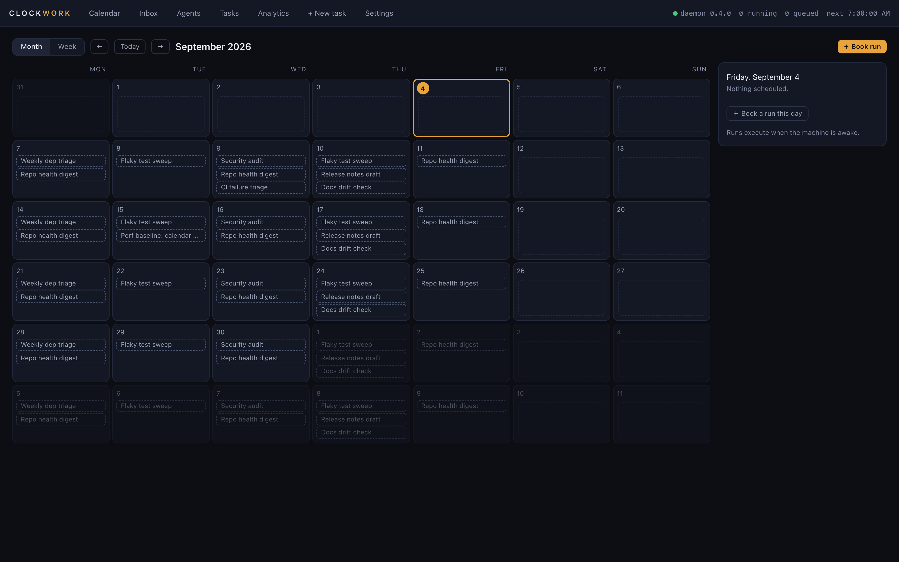
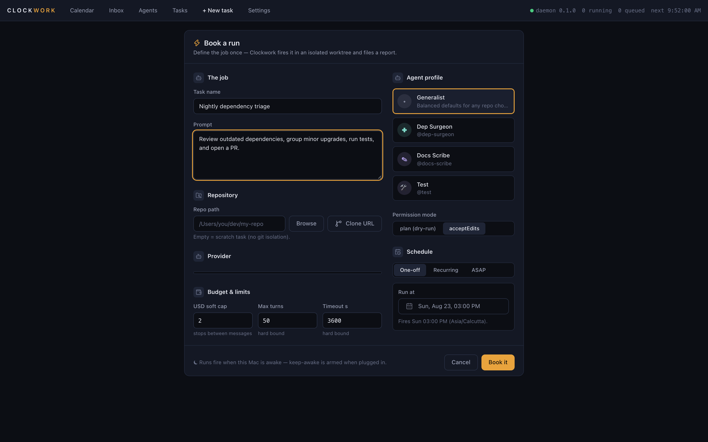
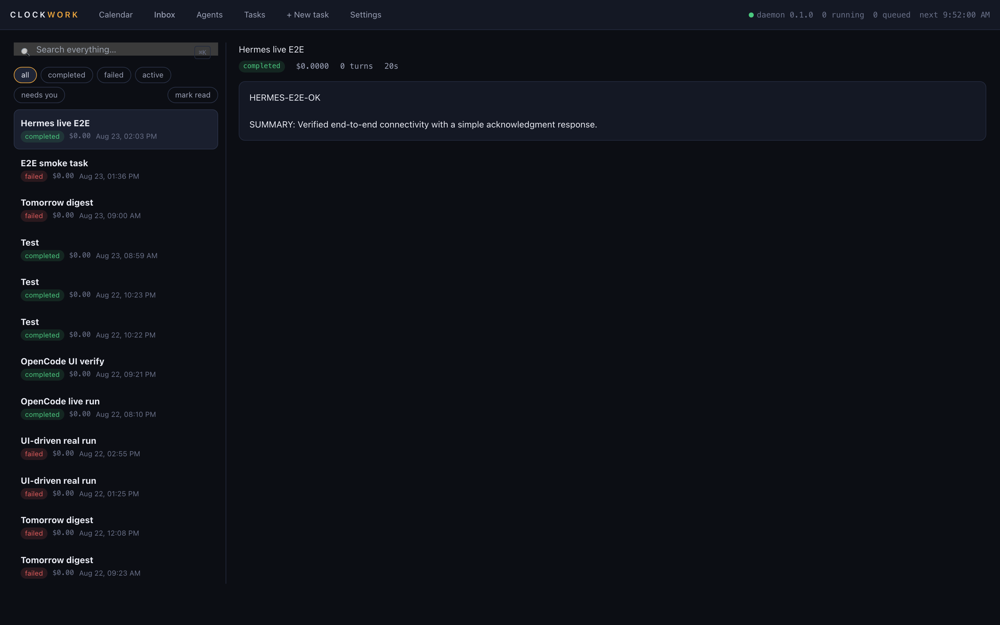
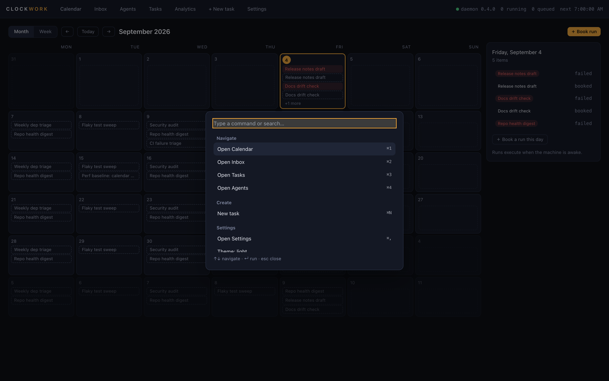

<div align="center">

# ⏰ CLOCKWORK

### The calendar where your AI agents show up for work.

**Book → Run → Review → Repeat**

Schedule recurring AI agent jobs on a real calendar. Clockwork executes them
unattended in isolated, sandboxed worktrees — and files a report you can
actually read.

[Website](https://clockwork.vmoksh-shah179.workers.dev/) · [Download](#-installation) · [Contact](mailto:vmoksh.shah179@gmail.com) · [Agent Library](#-agent-profile-library) · [Agent Workforce](#-agent-workforce) · [Providers](#-providers) · [Security](#%EF%B8%8F-security-model)

   [](https://vimoxshah.github.io/clockwork/)

</div>

---

## Why

You already pay for a coding agent. It idles 18+ hours a day.

Recurring agent work today lives in crontabs, shell scripts, CI pipelines, and
sticky notes. Clockwork gives that work a home on a **real calendar**:

| Without Clockwork | With Clockwork |
|---|---|
| Cron + terminal tabs | Month calendar with every job visible |
| Hope the script worked | Report with branch, diffstat, cost, transcript |
| Unbounded token spend | USD soft cap, plus hard turn / wall-clock caps |
| Agent has your whole disk | Per-run OS-sandboxed git worktree |
| Find last Tuesday's run: scrollback | Full-text search across retained history |
| The agent's work is never graded | An explicit verdict per run — accept, reject, or accept with a note the next occurrence reads |

## Screenshots

| Month calendar — the default view | Task composer |
|---|---|
|  |  |

| Run report | Command palette (⌘K) |
|---|---|
|  |  |

## The Loop

```
BOOK    Pick an agent profile, repo, budget, and time. One-off or recurring.
  ↓
RUN     Your own CLI engine executes unattended inside an OS-sandboxed
        git worktree. Never touches main. SSH keys unreadable.
  ↓
REVIEW  A human-readable report lands in your inbox — what it did,
        what it skipped and why, what it cost. You record a verdict.
  ↓
REPEAT  Make it weekly. Search your retained run history.
```

## ✨ Highlights

- 🗓 **A real calendar** — month/week views, recurrence (RRULE + cron),
  missed-run policies, per-repo mutex, queue with reasons
- 👤 **Human + agent time** — subscribe your personal calendar via a read-only
  ICS URL, or import a local `.ics` file as a dated snapshot you re-import
  yourself. Recurring external events render as a single `(recurring)` base
  occurrence — Clockwork does not expand an external RRULE
  (`packages/daemon/src/ics.ts`)
- 🔀 **Provider freedom** — Claude Code, Codex CLI, OpenCode, and Hermes Agent;
  switch per task without rebuilding anything
- 🤖 **13 production-grade agent profiles** — Dependency Surgeon, Test Doctor,
  Security Auditor, Code Reviewer and more, each with mission, constraints,
  safety rails, and an output contract
- 🛡 **Human-in-the-loop approvals** — risky actions pause the run and ask you;
  unanswered asks fail safe (never silently approved), and notify you when a run
  is waiting. The macOS notification is unconditional — no per-task setting gates
  it. Telegram, Slack and email are all configured from the app — credentials in
  Settings, per-task fields in the composer — and all three now receive the
  approval **request** as well as the run report, through one fan-out that
  serves both directions (`packages/daemon/src/delivery-dispatch.ts`). **The
  decision is not symmetric, and the screens say so.** You answer in Clockwork,
  or from the Telegram message itself
  (`packages/daemon/src/telegram-approvals.ts`), which carries approve/deny
  buttons behind an inbound poller. Slack and email can only point you at the
  Inbox — Slack because its interactivity POSTs the click to a public HTTPS URL
  and this daemon binds loopback only, so a button there would be a control
  that silently does nothing. The generic HMAC-signed outbound webhook has its
  signing secret in Settings, but its per-task URL is set through the API only;
  there is no field for it in the composer
- 🧱 **Policy floor in every mode** — force-pushes to protected branches and
  package publishing are refused before they run on the Claude engine, even when
  the CLI would not have asked (a `PreToolUse` hook, fail-closed, ~60 ms per call)
- 🔎 **Searchable execution history** — FTS across every report and transcript;
  ⌘K command palette everywhere
- 💰 **Budget enforcement by the supervisor** — USD soft cap, turn limits,
  wall-clock timeouts enforced outside the model
- 🔗 **Agent chains** — sequence agents (scan → fix → test → PR); each stage
  waits for its upstream and receives its report via `{{previous.report}}`
- 🔑 **Bring your own key** — OpenAI-compatible API providers (Anthropic,
  OpenAI, Google, OpenRouter, xAI, Mistral, DeepSeek, Ollama, custom gateways)
  with keys sealed in the macOS Keychain, connection validation, and clear
  separation from CLI-subscription billing
- 🏛 **Governance, with the seams shown** — the policy engine really does run on
  every task create, task edit and webhook fire (engine allow-lists and a per-run
  cost ceiling, `packages/daemon/src/policy-engine.ts`), and control-plane
  mutations really are appended to the audit log. But *reading* either back is a
  paid route: `GET /policies` and `GET /audit` answer **402** on the free tier,
  which is the tier every install runs at today, and neither has a screen. The
  retention sweep runs on a cadence and at startup (default 90 days / 1000 runs
  per task, `packages/daemon/src/retention-audit.ts`) and has no screen either.
  `requireApprovalOverUsd` is stored and validated but nothing consumes it yet
- 📊 **Cost & reliability analytics** — spend by task/provider/day with
  optimization suggestions that surface money-burning failures. Runs still in
  flight count as runs and as spend, are reported separately, and are excluded
  from every rate denominator and from average duration
  (`packages/daemon/test/analytics.test.ts`)
- 🏠 **Local-first** — SQLite in `~/.clockwork`, loopback-only API, no account,
  no cloud, no telemetry. The other side of that: **runs happen only while your
  Mac is awake**. Clockwork holds it awake across a run's window when you are on
  mains power, but it cannot wake a sleeping machine — see
  [Known limits](#-known-limits). There is no *Clockwork-hosted* runner and none
  is planned: it would need your provider key, which would negate the Keychain
  promise
- 🧑‍💼 **Agent workforce (12 features)** — plan-then-execute approval gates,
  shift-handoff memory, office hours, sentinel→worker pairs, repo-shipped job
  offers, run verdicts, an earned-autonomy ladder, self-healing diagnostics,
  agent-proposed calendar events, timesheets, scorecards, and a portable
  proof-of-work export. All twelve have a screen; three of them actually gate
  something. [Full table below](#-agent-workforce)

Event triggers — webhooks and GitHub events start tasks; see
[docs/triggers.md](docs/triggers.md).

## Providers

Clockwork drives the CLIs you already have — **no API keys required**.

| Provider | Auth | Status |
|---|---|---|
| **Claude Code** (default) | Your Claude subscription login | ✅ |
| **Codex CLI** | Your ChatGPT/Codex login | ✅ |
| **OpenCode** | Its own configured model | ✅ |
| **Hermes Agent** (Nous Research) | Your Hermes-configured provider/model | ✅ |

Detection is automatic (`Settings → Providers`): if the CLI is installed and
logged in, it appears with its version and a health check. Select the engine
per task in the composer — same task schema regardless of provider.

<details>
<summary><b>How provider execution works</b></summary>

Every provider implements the same `AgentRunner` contract (`packages/shared/src/runner.ts`):
spawn in the run's worktree, stream progress logs over SSE to the UI, enforce
budget bounds at supervisor level, map exits to failure classes
(auth / capacity / timeout / budget), and return a structured outcome that
becomes the report. Hermes runs via `hermes -z` one-shot mode with
`--usage-file` cost telemetry; Claude Code via `claude -p --output-format
stream-json`; Codex and OpenCode via their native headless modes.

</details>

## 🤖 Agent Profile Library

Profiles are production-grade operating contracts, not name stickers. Each one
defines mission, constraints, hard safety rules, and an output contract.

| Engineering | Operations & Docs |
|---|---|
| **Dep Surgeon** — patch/minor bumps proven by tests; majors get triage notes, never blind upgrades | **CI Investigator** — infra-flake vs regression triage from real logs |
| **Test Doctor** — flaky vs broken classification, minimal fixes, never weakens assertions | **Repo Health Monitor** — morning digest: stale branches, drift, advisories |
| **Bug Hunter** — evidence-first root cause before any fix | **Docs Scribe** — fix documentation drift from code evidence |
| **Code Reviewer** — read-only, severity-rated findings with file:line evidence | **Changelog Writer** — entries derived from actual diffs, never invented |
| **Refactoring Engineer** — behavior-preserving, tests green at every step | |
| **Performance Engineer** — measure baseline → change one thing → re-measure | |
| **Security Auditor** — report-only defensive scan; secrets masked | |
| **Release Engineer** — version/changelog/build readiness checks | |

Twelve specialists, plus a **Generalist** for work that does not fit one — thirteen
seeded profiles in all (`packages/daemon/src/profiles.ts` +
`packages/daemon/src/profile-library.ts`).

Create your own in-app (**Agents → New profile**): pick skills, permission
mode, budget defaults, and system prompt — bookable a minute later.

## 🧑‍💼 Agent Workforce

Twelve features that turn a calendar of scheduled runs into something closer to
a team you manage. Every one of them has a screen in this build, and each screen
declares its own location at the module scope of the file that mounts it
(`packages/ui/src/components/featureSurfaces.ts`) — so the capability matrix
behind **Settings → "What does each plan include?"** can tick a capability only
when a mounted component actually registered one, and the tick doubles as a link
that takes you there. Forgetting to register under-claims; it cannot over-claim.

**Read the status column literally.** It is the word `packages/daemon/src/features.ts`
carries, and that file defines the two values narrowly:

- **enforced** — daemon code *outside* the `/workforce/*` routes refuses or
  defers a user action because of this feature.
- **available** — you can reach it today, and it gates nothing.

Three qualify as enforced. The other nine are real features you can use; they
just do not stand in anything's way.

| Feature | Where it lives | Status | What it does, and what it refuses |
|---|---|---|---|
| **Plan → execute** | `Tasks › Plan → execute` | **enforced** | One booking becomes two runs: a `plan`-mode run at an hour you pick, then an execute half created `enabled=0` that stays that way. Approving the plan books the execute run directly rather than re-enabling the task. **Refuses:** while the pair is unapproved, `POST /tasks/:id/run-now` and a webhook fire on the execute half both return **409**; `PATCH /tasks/:id {"enabled":true}` on an execute half returns 409 at *any* pair status, because re-enabling it would let a later plan run fire it through the chain with a plan nobody read (`planExecuteGate`, `packages/daemon/src/api.ts`). |
| **Shift handoff** | `Inbox › a run’s report` | available | A recurring task carries a memory across occurrences — what it tried, what blocked it, what to check next. **One setup step is yours:** the memory is injected only if the prompt contains the literal `{{handoff.previous}}`. A task that does not ask never gets it. |
| **Office hours** | `Settings › Office hours` | **enforced** | You declare the windows in which you can answer an approval. **Defers, never cancels:** a due fire is pushed to the next window and the occurrence is recorded `deferred`. It applies only to tasks whose *profile* carries `may_require_approval`, and no profile route sets that column — autonomy enrolment is the only writer, which makes it a **three**-step setup, not two. Off by default, and it fails open: a broken config, no matching window, or an unflagged profile all mean "fire on schedule". |
| **Sentinel → worker** | `Tasks › Sentinels` | available | A cheap, frequent check books the expensive run when it trips, through the same policy and trigger path a webhook fire uses. Every evaluation is written down — a non-trip, a cooldown, a disabled sentinel, and a policy refusal each leave a row with its reason. **Refuses (422):** a sentinel bound to a trigger that books the sentinel itself, which is an infinite loop. |
| **Repo-shipped jobs** | `Tasks › Repo jobs` | available | A repo can declare recommended jobs in `.clockwork/jobs.json` (or `.yaml`, through a restricted parser that adds no new dependency). Clockwork **offers** them and imports nothing on its own; import creates the task **disabled**, behind a security preview computed at discovery time. **The job file cannot choose its own power or budget:** import hardcodes `acceptEdits`, $2 / 50 turns / 1h and no profile, whatever the file asks for. The red-flag 422 on import is real but unreachable from discovery — see the F5 note in the guide before treating it as a defence. |
| **Accept with a note** | `Inbox › a run’s report` | available | The per-run verdict: accept, reject, or accept-with-a-note. Re-deciding updates the verdict instead of stacking a second one. A note is appended to that task's handoff memory as a human-authored entry, so your correction is what the next occurrence's agent reads. This is the acceptance signal the autonomy ladder, timesheets and scorecards all read. |
| **Earned autonomy** | `Settings › Earned autonomy` | **enforced** | Opt-in, and a rung is **offered, never granted** — a streak of accepted runs writes an offer row and nothing else; only your acceptance writes the new rung. **Refuses (403 `autonomy_rung_exceeded`)** at task create, task patch and the webhook fire path — in practice only when the profile sits at the bottom `plan` rung and the task asks for another mode. The top two rungs share the permission mode `acceptEdits`, so neither refuses anything; the `acceptEdits → unattended` step's whole effect is to clear the office-hours flag. Enrolling **overwrites** the profile's permission mode, and the app warns before it does. An unenrolled profile is unconstrained, on purpose. |
| **Self-healing** | `Inbox › Approvals (remediation proposals)` | available | After N consecutive failures (default 3) Clockwork books one diagnostic run with the failed transcripts as context, whose instruction is "propose exactly one change, change nothing". The output is an approval item. **The agent never edits its own prompt or profile:** inside this feature, `apply()` is the only writer of `tasks.prompt` / `tasks.profile_id`, and it runs only from your click on *Apply change* — never from inside the diagnostic run (`packages/daemon/src/self-healing.ts`). Elsewhere in the product, `PATCH /tasks/:id` can still write both columns; that is your edit, not the agent's. At most one diagnostic per failure streak; a failed diagnostic books no second one. |
| **Proposed events** | `Inbox › a run’s report (when it proposes events)` | available | A report may suggest calendar events, offered as a download. **Clockwork never writes to your calendar** — there is no write path in the module, and the ICS overlay stays read-only. Model output is untrusted, so the parse is bounded: ≤20 suggestions, ≤8 KB block, first block only, Clockwork assigns the `.ics` UID, control characters stripped, credentials masked, and a bad block costs the suggestions rather than the run (`packages/runner/src/proposed-events-parse.ts`). Nothing is injected into your prompts, so an agent that is never asked proposes nothing. |
| **Timesheets** | `Analytics › Timesheets` | available | Hours worked, dollars spent, outcomes accepted, and an effective hourly rate per profile over any range — against an optional rate for your own time. **The accuracy caveat is shown unconditionally,** because a run that was still active when the daemon restarted is closed out at the restart time and so counts the downtime as work; the per-row flag on top of that is best-effort. The rate is `null`, never `Infinity` or `0`, when no hours were worked. |
| **Performance reviews** | `Analytics › Performance reviews` | available | Acceptance rate, failure rate and cost trend against the prior window — **plain SQL, no model call**. An unreviewed agent reads as "not yet reviewed", never as a 0% failure. `/review-prompt` returns the *text* of a prompt; writing the prose review means scheduling a task with it. No seeded reviewer profile does that for you. |
| **Proof-of-work export** | `Inbox › a run’s report` | available | One run's report as a single self-contained HTML file you host yourself — no script tags, no stylesheet links, no remote images, no telemetry pixel. Secrets are masked with no flag to turn it off, every interpolation is escaped, `redactPaths` strips repo/worktree/branch, the transcript is **off by default**, and every export is audited. |

Routes, refusal paths, per-feature tests and the measured numbers:
[docs/agent-workforce.md](docs/agent-workforce.md).

## 📦 Installation

> macOS 14+ (Apple silicon). Free during beta.

### Download the app

```bash
# 1. Verify the bytes BEFORE you trust them
shasum -a 256 ~/Downloads/Clockwork_*_aarch64.dmg
curl -s https://clockwork.vmoksh-shah179.workers.dev/downloads/checksums-sha256.txt
# if the two do not match: stop, do not install, report it

# 2. Open the DMG, drag Clockwork to Applications, then clear quarantine
xattr -dr com.apple.quarantine /Applications/Clockwork.app

# 3. Launch
open -a Clockwork
```

**That is the whole install.** The app carries the daemon and its own Node, so
there is no checkout, no `pnpm`, no Node to install, and no token to paste. On
first launch Clockwork registers its background service with launchd, which is
what keeps scheduled runs firing after you close the window and after a reboot,
and pairs the window with the daemon's token itself. Move the app afterwards and
it re-points the service at the new location.

Two things it cannot bring with it, because they are yours and already logged
in: **git**, and at least one agent CLI (`claude`, `codex`, `opencode` or
`hermes`). `clockworkd doctor` names either one when it is missing.

**Releases are unsigned.** There is no Apple Developer certificate on this
project, so the release workflow ad-hoc signs the bundle
(`.github/workflows/release.yml` exports `APPLE_SIGNING_IDENTITY="-"` when no
certificate is configured) and nothing is notarized. macOS Gatekeeper will
refuse the app — often with a misleading "damaged" message — until you clear the
quarantine flag by hand. Clearing it tells your Mac you trust that specific
binary, which is exactly why the hash check comes first. Homebrew
(`brew install --cask clockwork`) verifies the SHA-256 for you but cannot skip
quarantine either. Full detail, including the Homebrew tap:
[docs/install.md](docs/install.md).

### Or run it from source (for development)

```bash
# 1. Clone and install
git clone https://github.com/vimoxshah/clockwork.git
cd clockwork
pnpm install

# 2. Build everything
pnpm build

# 3. Start the daemon (serves UI + API on 127.0.0.1:4747)
node packages/daemon/dist/main.js

# 4. Pair the UI
open http://127.0.0.1:4747
# Paste the token from:
cat ~/.clockwork/api-token
```

Prerequisites:
- Node.js ≥ 22, pnpm ≥ 11 (`corepack enable`). Run `pnpm install` with the same
  Node you will start the daemon with: `better-sqlite3` is a native module
  compiled for one Node ABI, so switching versions afterwards (a Homebrew
  upgrade will do it) leaves the daemon unable to start, with
  `NODE_MODULE_VERSION` in `~/.clockwork/daemon.log.err`. `pnpm install` again
  to rebuild.
- At least one provider CLI installed and logged in:
  - [`claude`](https://docs.anthropic.com/en/docs/claude-code) (recommended default)
  - [`codex`](https://github.com/openai/codex), [`opencode`](https://opencode.ai), or [`hermes`](https://github.com/NousResearch/hermes-agent) for alternative engines
- git

<details>
<summary><b>Desktop app (Tauri)</b></summary>

```bash
pnpm tauri build          # unsigned .app + DMG in src-tauri/target/release/bundle/
```

`tools/stage-bundle.mjs` runs first and stages what the app needs to stand on
its own: the daemon's production tree into `Contents/Resources/app` (laid out
as a miniature of the repo, because `main.js` walks to `../migrations`,
`../../ui/dist` and `../../../resources/skill-pack`) and the Node running the
build into `Contents/MacOS` via `externalBin`, where Tauri signs it. That Node
is the one `better-sqlite3` is compiled against in the same command, so the
`NODE_MODULE_VERSION` mismatch cannot happen in a released build.

The shell installs the LaunchAgent, re-points it when the app moves, restarts a
daemon left stale by an update, and pairs the token. When the daemon still does
not answer, the window shows `daemon-down.html` (`packages/ui/public/`) with the
cause this install actually has and one command to run, then navigates to the
real UI as soon as the port answers.

This build is unsigned and un-notarized; the release workflow only signs when
Apple Developer credentials are present in CI, and they are not.

</details>

<details>
<summary><b>Run as a background service</b></summary>

```bash
# clockworkd entrypoint: install/uninstall/doctor
npx tsx packages/daemon/src/cli.ts install
clockworkd doctor        # verifies PATH, providers, data dir
```

Only one daemon may hold the port; a second one exits with a diagnostic naming
the version skew instead of crash-looping behind an older build. The app shows a
restart banner when the running daemon and the one on disk disagree.

</details>

## 🚀 First run in 60 seconds

1. Open Clockwork → **+ New task**
2. Name it "Nightly dependency triage", pick the **Dep Surgeon** profile
3. Choose your repo, set a $1 cap, leave provider = Claude Code
4. Schedule: weekly, Monday 07:00 — or just hit **ASAP**
5. Come back later: the report is in your **Inbox** — branch, diffstat, cost.
   Record a verdict while you are there; several features read it.

## ⌨️ Keyboard shortcuts

| Keys | Action |
|---|---|
| `⌘K` | Command palette (navigate, themes, create) |
| `⌘N` | New task |
| `⌘1–4` | Calendar / Inbox / Tasks / Agents |
| `⌘,` | Settings |
| `/` | Focus inbox search |

Analytics sits between Tasks and **+ New task** in the tab bar and has no
shortcut of its own. Full list: [docs/SHORTCUTS.md](docs/SHORTCUTS.md)

## 🏗 Architecture

```
┌──────────────┐   HTTP + SSE (loopback :4747, bearer token 0600)
│   UI (React) │◄───────────────────────────┐
└──────────────┘                            │
      Tauri shell loads the same URL        │
                                             │
┌────────────────────────────────────────────▼───┐
│                clockworkd (Fastify)            │
│  scheduler · queue + repo mutex · run manager  │
│  approvals · budgets · delivery · audit journal│
│                    SQLite ~/.clockwork         │
└──────────────────────┬─────────────────────────┘
                       │ spawn per run
            ┌──────────▼───────────┐
            │  runner child process│  own pgid, Seatbelt profile
            │  AgentRunner contract│  Claude │ Codex │ OpenCode │ Hermes
            └──────────────────────┘  worktree-isolated git operations
```

- **Monorepo:** `packages/shared` (schemas/contracts) · `packages/runner`
  (engine runners + sandboxing) · `packages/daemon` (API/scheduler/state) ·
  `packages/ui` (React + Tailwind design system)
- **Deterministic tests:** `CW_MOCK_STEP_MS` makes full-loop integration tests
  sample intermediate states without sleeps
- **A screen declares itself:** a capability is ticked as reachable only when the
  component that mounts it registers a surface at module scope
  (`packages/ui/src/components/featureSurfaces.ts`,
  `packages/ui/src/components/LicenseCard.tsx`). A feature that ships a daemon
  route with no screen, or an orphan component nobody imports, registers nothing
  — so the failure mode is a missing tick, not a false one

## ⚖️ Security Model

- **Isolation:** each run gets a fresh git worktree + branch cut from base;
  a macOS Seatbelt (`sandbox-exec`) profile restricts writes to that worktree,
  Clockwork-managed tool caches, and the engine's own state dirs — for every
  engine, including the BYOK agent's shell. Turning it off (`CW_SANDBOX=off`)
  is journaled and stamped on the report.
- **Credential hygiene:** sanitized child environment (allowlist, so
  `SSH_AUTH_SOCK` and provider keys never reach the agent); the sandbox denies
  reads of `.ssh`, `.aws`, `.gnupg`, gcloud, browser profiles, shell history;
  secret masking in reports. Keychain *files* stay readable — Claude Code needs
  its own OAuth item — see `docs/security.md` for why.
- **Approvals (Claude engine):** gated tool calls pause the run and **hold until
  you answer or the run's wall-clock budget ends**, then fail-safe deny — recorded
  for audit either way. Other engines have no permission hook; the sandbox is
  their containment.
- **Budgets:** USD soft cap + turn cap + wall-clock timeout enforced by the
  supervisor process, not by the model's self-restraint
- **Local-only:** daemon binds 127.0.0.1; bearer token file is 0600; no
  analytics, no account, no cloud component

**Audit it yourself.** `packages/runner/src/{sandbox,deny-list,run-env,service-path}.ts`
are the security boundary, dual-licensed under Apache-2.0 (LICENSE §12), and
`packages/runner/test/` exercises them against a real `sandbox-exec` — the suite
writes a fake secret into `~/.ssh` and `~/.aws`, then runs `cat` inside the
sandbox and asserts it fails.

What that does **not** prove:

- That the DMG you downloaded was built from this source. Releases are built by
  GitHub Actions from this repository and the checksums are published, but
  reproducing the binary yourself is not yet supported.
- That Apple has checked anything. The build is **not signed with an Apple
  Developer identity and not notarized** — see [Installation](#-installation).
- That the sandbox alone stops ssh-agent forwarding. The Seatbelt profile permits
  `system-socket`; that claim holds because of the run-env allowlist, not the
  sandbox.

Details: [docs/security.md](docs/security.md) · [docs/privacy.md](docs/privacy.md)

## 🔍 Known limits

Open, reproducible, and written down here rather than discovered by you:

- **A refused execute booking strands its pair.** When you approve a plan, the
  verdict commits first and the booking is attempted second. If the booking is
  refused — the policy engine rejects the execute half, the execute task was
  deleted between the plan run and your decision, or the booker throws — the pair
  stays at status `approved` with no execute run, and a second resolve answers
  `already_resolved`, so nothing re-books it
  (`packages/daemon/src/plan-execute.ts:327`, `:349`). A policy refusal is
  audited (`plan_execute.book_rejected`) rather than silent. *Run now* on that
  half is allowed once the pair reads `approved`, but that path does not bind the
  approved plan into the prompt, so it is not an equivalent recovery. (A **paused**
  daemon is not one of these cases: the run is queued and the pair reaches
  `executed` normally.)
- **The calendar latency ceiling is proven on one machine, not on the
  acceptance machine.** Every number was measured on an Apple M4; the
  acceptance criterion names a base M1 Air, which has never been measured at
  all. On the M4 the year-view median over 5,000 runs is
  40.82–42.17ms across three full test runs on 2026-09-07, against a 500 ms
  bound. Before the RRULE anchor fix the same
  measurement ranged 349.59–684.26ms across ten runs on one laptop at one
  commit: it met the bound in six and missed it in four, and the p95 was above
  the ceiling in seven, decided by machine load rather than by code. That is
  why the bench measures by default and only asserts under
  `CLOCKWORK_BENCH_ASSERT=1` — the gate is about a wall-clock assertion
  deciding a build, not about the size of the margin. Full record:
  `plan/STATUS.md` (T-307) and `docs/architecture/scalability.md`.
- **One recurrence shape still hangs, and the defect is upstream.** An hourly
  rule whose coarser `BY` part cannot be reached from its own `INTERVAL` grid —
  `FREQ=HOURLY;INTERVAL=2;BYHOUR=3`, whose hours stay even — never terminates
  inside rrule 2.8.1's skip loop. It behaved that way before the anchor work and
  it behaves that way after, because the reachable residues depend only on
  `gcd(INTERVAL, 24)`. Nothing in Clockwork refuses such a rule yet.
- **Four older capabilities have no screen, and two of them have no setter
  either.** Retention is API-only (`PUT /retention`), and an outbound webhook's
  URL is API-only (a task's or profile's delivery config). **Quiet hours has no
  reachable setter at all:** the scheduler honours `delivery_json.quietHours`,
  but `DeliveryConfig` in `packages/shared/src/schemas.ts` carries no
  `quietHours` key, and zod strips unknown keys — so the field is dropped on the
  way in, and only a direct write to SQLite can set it. **Container execution is
  a probe, not a target:** `GET /targets` reports whether Docker is available and
  nothing dispatches a run to it. None of the four registers a surface, which is
  why the capability matrix does not tick them.
- **Keep-awake holds the Mac awake, but cannot wake it.** The daemon arms a
  macOS power assertion (`caffeinate`) for a run's budgeted window and releases
  it afterwards. It declines on battery unless you set
  `CLOCKWORK_KEEP_AWAKE_ON_BATTERY=1`, and the OS still wins if you shut the lid.
  Nothing schedules a *wake*, so a machine already asleep at the fire time stays
  asleep and the run is handled by the missed-window policy. The report's
  `sleptThroughKeepAwake` field is still hardcoded `false` and does not yet
  detect that case. For genuinely unattended overnight work, use a machine that
  stays on.

## 📚 Guides

- [BYOK guide](docs/byok-guide.md) — connect Anthropic, OpenAI, Google,
  DeepSeek, Z.ai, and more; key storage, defaults, error decoding
- [Install & security](docs/install.md) — verified checksums, what Clockwork
  can reach once installed, and why quarantine must be cleared by hand
- [Troubleshooting](docs/troubleshooting.md) — daemon, auth, scheduling, and
  license/plan problems
- [Agent workforce guide](docs/agent-workforce.md) — all twelve features:
  routes, what each one enforces vs. merely offers, and where it's tested

## 🧪 Development

```bash
pnpm typecheck        # shared + runner + daemon
pnpm lint             # eslint
pnpm test             # vitest — unit + integration incl. full-loop E2E
pnpm build            # all workspace packages

# UI package only
pnpm --filter @clockwork/ui dev       # vite (proxies nothing; use served app)
pnpm --filter @clockwork/ui build
```

The e2e scripts under `packages/ui/e2e/` are Playwright harnesses used during
development to verify the real served application end-to-end (calendar,
themes, palette, providers, ICS overlay, 1000-task benchmarks).

**The docs are on the build.** `packages/daemon/test/claims-honesty.test.ts`,
`feature-honesty.test.ts` and `landing-honesty.test.ts` read this README, the
landing page and the design docs, and fail the suite when the prose claims more
than the code delivers — a permanence claim retention would contradict, a cited
path that does not exist, an upgrade modal selling a feature that was deleted.
An overclaim here is a red build, not a marketing choice.

## 🗺 Roadmap

- [x] Multi-provider execution (Claude/Codex/OpenCode/Hermes)
- [x] BYOK API providers (8 kinds, Keychain-stored, validated)
- [x] Command palette + shortcut registry
- [x] Human calendar overlay — ICS by subscription URL *and* by local file import
- [x] 1000-task scale verification
- [x] Agent chains (chain-after + trigger states + `{{previous.report}}` hand-off)
- [ ] Docker execution target — runner module (`runInDocker`,
      `packages/runner/src/docker-runner.ts`) and an availability probe
      (`GET /targets`) exist, but nothing wires a task run to it yet: no
      task-level target field, no run-manager dispatch, no UI selector
- [x] Governance: policy engine, audit log, retention, capability matrix
      (evaluation and audit-writing run on every install; reading policies or the
      audit log is a paid route and neither has a screen — see Highlights)
- [x] Event triggers: webhook + GitHub sources fire tasks (HMAC-verified)
- [x] Plan-then-execute approval gate + sentinel→worker trigger pairs +
      repo-shipped job offers (`docs/agent-workforce.md`)
- [x] Governance ladder: office-hours approval deferral, an earned-autonomy
      ladder that only offers (never auto-grants) the next rung — of which
      only the bottom rung refuses a task, see `docs/agent-workforce.md` —
      self-healing diagnostics that only propose (never self-apply) a fix
- [x] Workforce analytics: shift-handoff memory, accept/reject-with-a-note,
      agent timesheets, performance scorecards, portable proof-of-work
      export, download-only agent-proposed calendar events
- [x] A screen for all twelve agent-workforce features — Settings gains office
      hours and the autonomy ladder, Tasks gains plan→execute pairs, sentinels
      and repo-job import, Analytics gains timesheets and scorecards, the Inbox
      gains handoff memory, proposed events and proof-of-work export
- [x] Self-declaring capability surfaces — a feature is ticked as reachable only
      when the component that mounts it registers itself, so the plan matrix
      cannot claim a screen that does not exist
      (`packages/ui/src/components/featureSurfaces.ts`)
- [x] Telegram delivery: bot credentials in Settings, chat id per task in the
      composer, and approve or deny a waiting run from the chat message
- [x] Slack and email delivery — Slack posts Block Kit through an incoming
      webhook; email goes out over an SMTP client written on Node's standard
      library, with no dependency added. Both have Settings fields with a
      test-send and per-task composer fields, and both receive approval
      requests as well as run reports. Neither can take the decision — that
      still happens in the app or in Telegram
- [ ] Chaining v2 (fan-in/out DAGs)
- [ ] RRULE expansion for external calendars — `packages/daemon/src/ics.ts`
      emits one `(recurring)` base occurrence per recurring event instead
- [x] Per-day calendar aggregation and a bounded `/calendar` payload —
      `GET /calendar?group=day` returns one row per non-empty day with its
      outcome breakdown, both modes cap at 5,000 rows per collection, and every
      response reports the bound it applied and whether it hit it
- [ ] Signed & notarized desktop builds
- [ ] Kubernetes / cloud execution targets beyond Docker
- [ ] SSO / SCIM for enterprise deployments

## License

Clockwork is **proprietary software** — see [LICENSE](LICENSE).

- **Personal, non-commercial use:** free. Run it on your own machines for your own work.
- **Commercial use** (company-wide internal use, redistribution, or offering Clockwork-based functionality to others): requires a written Commercial License from the author.
- The repository is public so you can audit exactly what runs on your machine — that transparency is a feature, not an invitation to redistribute.

Third-party open-source components keep their own licenses; see [NOTICE](NOTICE).

---

<div align="center">
<sub>Built for people who feel the chore pain weekly.</sub>
</div>
